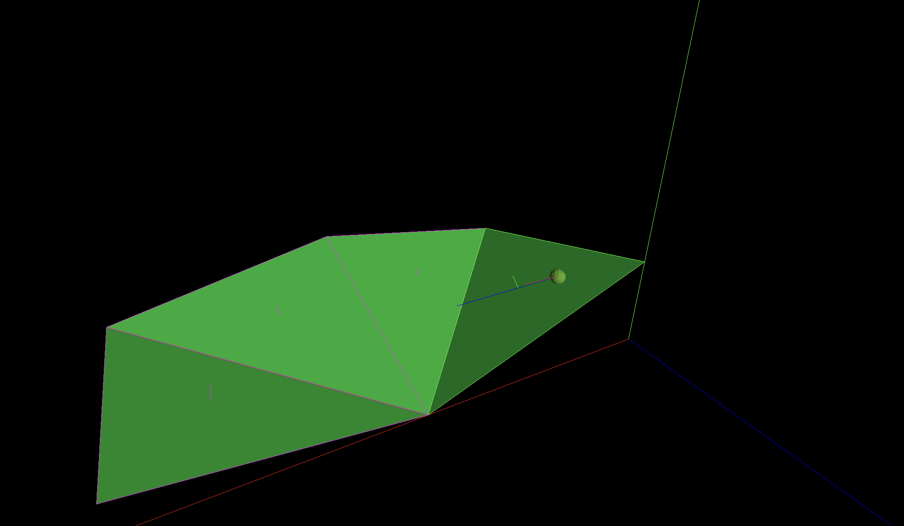

# Floof, The Cross Platform Vulkan Physics Engine


### Works on Windows, Linux og MacOS


## Bygge instrukser Windows:
* Oppdatert versjon av Visual studio 2022
* Oppdatert versjon av CMake
* Oppdatert versjon av Vulkan SDK https://vulkan.lunarg.com/sdk/home
  * Da med alle komponenter under installasjon

Siden prosjektet har bibliotek som git-submodules må man dra ned prosjektet med
```
git clone --recursive https://github.com/STEN1/Floof
```
* Clone projektet med kommandoen over
* Åpne selve Floof mappen i Visual Studio siden det er ingen .sln fil
* Høyreklikk på CmakeList.txt i Visual studio og velg "delete cache and reconfigure"
  * Dette vil kjøre cmake commando for å kompilere shadere til spir-v filer med kompilator som kom med Vulkan SDK
* Nå kan du velge Floof.exe fra dropdown oppe ved valg om å kjøre i debug eller release


## Bygge instrukser Macos

Note last ned nyeste versjon av Vulkan SDK til Macos med alle komponenter under installasjon
* Oppdatert versjon av Vulkan SDK https://vulkan.lunarg.com/sdk/home
  * Da med alle komponenter under installasjon

### Nødvendige pakker fra Brew
```
Brew install cmake
Brew install molten-vk
Brew install vulkan-header
Brew install vulkan-loader
```

### Klone og kompilere prosjektet
```
cd ${Project location}
```
```
git clone --recursive https://github.com/STEN1/Floof
```

```
mkdir build
cd build
```

```
cmake ..
make -j8
```


