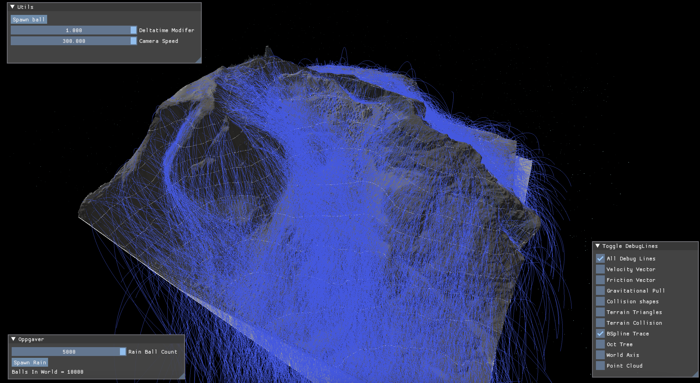

# Floof, en multiplatform Vulkan fysikkmotor


## NB. Terrengdatafilen er for stor for github
* Last ned jotun.las fra google drive
	* put filen i /Assets/ mappen til prosjektet
* https://bit.ly/3M7KHBX

### Testet på Windows, Linux og macOS
 * Apple Silicon M1
 * AMD Graphics
 * Intel Graphics
 * Nvidia Graphics

### Kontrolloppsett
| Beskrivelse           | Knapp          | 
|-----------------------|----------------|
| Styring av kamera     | WASD           | 
| Hev / senk kamera     | E / Q          | 
| Rotering av kamera    | LCtrl / RMouse | 


## Byggeinstrukser for Windows:
* Oppdatert versjon av Visual studio 2022
* Oppdatert versjon av CMake
* Oppdatert versjon av Vulkan SDK https://vulkan.lunarg.com/sdk/home
  * Da med alle komponenter under installasjon

* Siden prosjektet har bibliotek som git-submodules må man dra ned prosjektet med
```
git clone --recursive https://github.com/STEN1/Floof
```
* Åpne selve Floof mappen i Visual Studio siden det er ingen .sln fil
* Høyreklikk på CmakeList.txt i Visual studio og velg "delete cache and reconfigure"
  * Dette vil kjøre cmake commando for å kompilere shadere til spir-v filer med kompilator som kom med Vulkan SDK
* Nå kan du velge Floof.exe fra dropdown oppe ved valg om å kjøre i debug eller release


## Byggeinstrukser for macOS

Note last ned nyeste versjon av Vulkan SDK til macOS med alle komponenter under installasjon
* Oppdatert versjon av Vulkan SDK https://vulkan.lunarg.com/sdk/home
  * Da med alle komponenter under installasjon

### Nødvendige Brew-pakker
```
Brew install cmake
Brew install molten-vk
Brew install vulkan-header
Brew install vulkan-loader
```

### Klone og kompilere prosjektet
```
cd ${Project location}
```
```
git clone --recursive https://github.com/STEN1/Floof
```

```
mkdir build
cd build
```

```
cmake ..
make -j8
```

## Byggeinstrukser for Linux (Ubuntu)

* Oppdatert versjon av CLion
* Oppdatert versjon av CMake
* Oppdatert versjon av Vulkan SDK https://vulkan.lunarg.com/sdk/home
  * Lag en arbeidsmappe 
  ```
  cd ~
  mkdir vulkan
  cd vulkan
  ```
* Pakk ut SDKen
  ```
  tar xf $HOME/Downloads/vulkansdk-linux-x86_64-1.x.yy.z.tar.gz
  ```
* Registrer permanente Enviroment-variabler
  ```
  sudo nano .bash_profile
  ```
  * Legg til følgende på en ny linje:
  ```
  source ~/vulkan/1.x.yy.z/setup-env.sh
  ```
* Sjekk at SDKen fungerer
  * Vulkan Installation Analyzer (VIA) with the command:
	```
	~$ vkvia
	```
  * Vulkan Info with the command:
	```
	~$ vulkaninfo
	```
  * Vulkan Cube with the command:
	```
	~$ vkcube
	```
* Klone prosjektet med
```
git clone --recursive https://github.com/STEN1/Floof
```
* Åpne mappen med CLion

* Voila!
